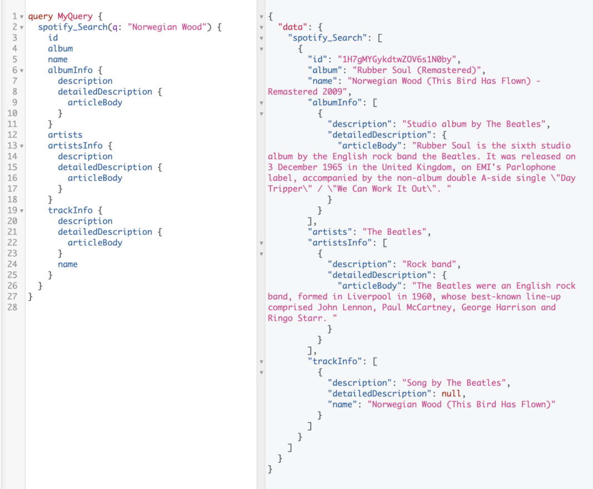

This repo contains the code referenced in the post below, a quick walkthrough of StepZen's new GraphQL Studio tool:

- **[Behind the Music (in Two Sentences or Less)](https://stepzen.com/blog/new-workflowf-for-api-mash-ups-postman-stepzen-youtube-data-api): Mashing up the Spotify & Knowledge Graph APIs**

  > And with that, our Spotify track query now returns Knowledge-annotated data, with short (and shorter) descriptive summaries of a track, the album it came from, and its recording artist:

 

  

