### Behind the Music (in Two Sentences or Less)  ###
*Mashing up the Spotify & Knowledge Graph APIs, using StepZen's new GraphQL Studio.*

The boxes of summarized information that appear beside Google search results? Those are Google's "knowledge panels," so-called because they're powered by [Google's Knowledge Graph](https://medium.com/r/?url=https%3A%2F%2Fen.wikipedia.org%2Fwiki%2FGoogle_Knowledge_Graph), a knowledge base launched in 2012 and currently boasting more than 500 billion facts on 5 billion entities.

<p align="center">
  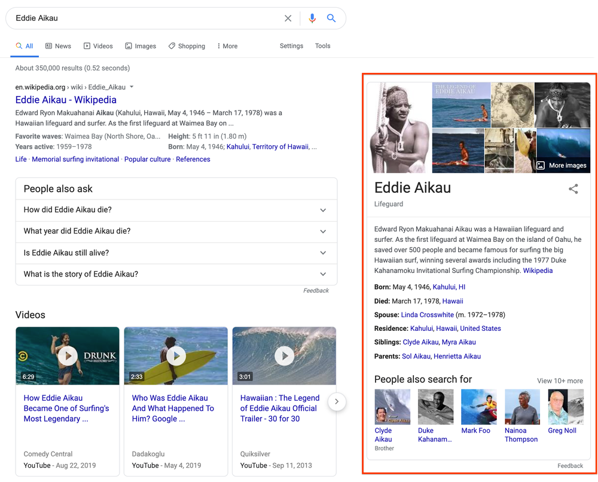
</p>

##### *A reintroduction to our Knowledge Graph and knowledge panels ([Google Keyword blog, 2020](https://medium.com/r/?url=https%3A%2F%2Fblog.google%2Fproducts%2Fsearch%2Fabout-knowledge-graph-and-knowledge-panels%2F))* #####

Largely derived from Wikipedia text, data from the Knowledge Graph has some appealing qualities to API-handy developers: a zillion concise factual summaries being one, and a daily allocation of [100,000 free APIs calls](https://medium.com/r/?url=https%3A%2F%2Fdevelopers.google.com%2Fknowledge-graph%2Freference%2Frest%2Fv1%2Fusage-limits) being another.

This makes it an ideal secondary API to augment any sort of entity-heavy data, Spotify's API being a perfect example. And whereas cramming random Google queries into one's Spotify data pipeline might otherwise be a cumbersome bit of orchestration, StepZen makes such coupled API calls irresistibly easy.

Moreover, StepZen's new GraphQL Studio, which includes presets for both APIs, makes it easier than ever to deploy a working demo and try it for yourself. Just follow the 5 steps below and you'll have a hybrid Spotify/Knowledge endpoint deployed in minutes:

#### 1. Select Spotify and Google Knowledge Graph APIs ####

To start, open GraphQL Studio by visiting [graphql.stepzen.com](http://graphql.stepzen.com). (No login required.) In the schema browser on screen left, you'll find a list of pre-built API schemas, arranged alphabetically under All Schemas. Select Google Knowledge Graph Search and Spotify by clicking their respective (+) buttons.

<p align="center">
  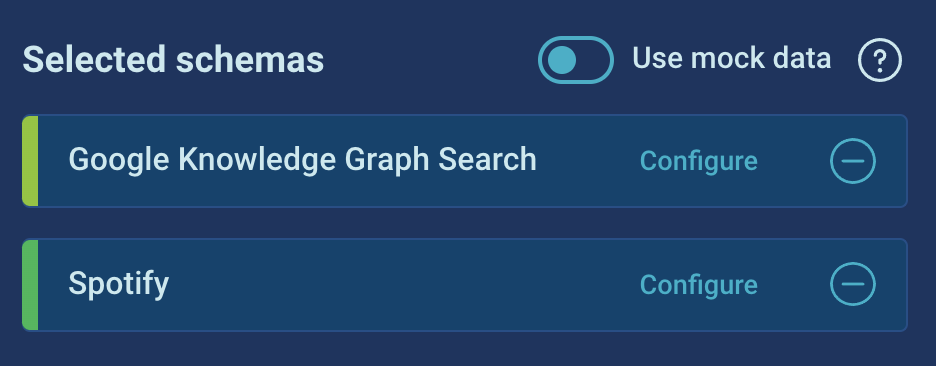
</p>

You can immediately execute the example queries, if you toggle active StepZen's mock data feature.

<p align="center">
  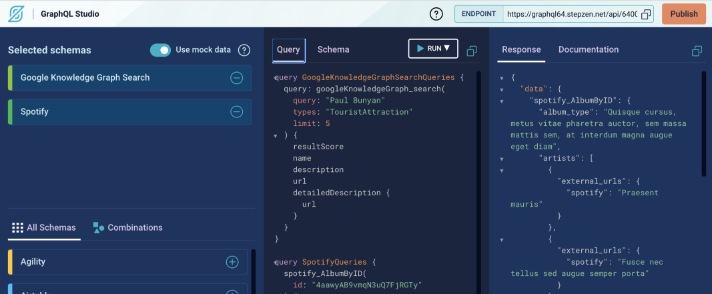
</p>

#### 2. Generate a Google API key and a Spotify bearer token ####

To test queries against live data, you'll need to generate an API key for Google and a bearer token for the Spotify API.

<p align="center">
  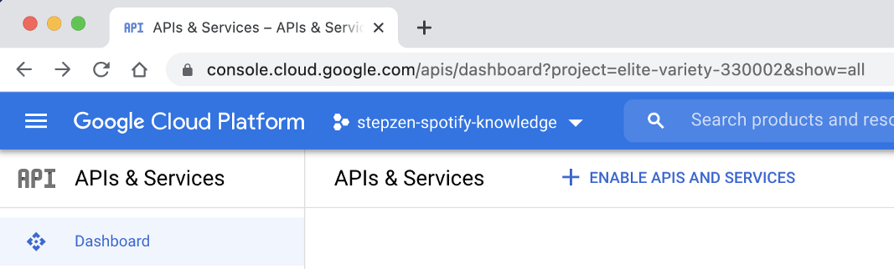
</p>

The Google API key is relatively straightforward: just register a new app in your Google Cloud Project dashboard and enable the Knowledge Graph API at console.cloud.google.com/apis. (Find the API by name using Google's "Welcome to APIs & Services" search bar.)

<p align="center">
  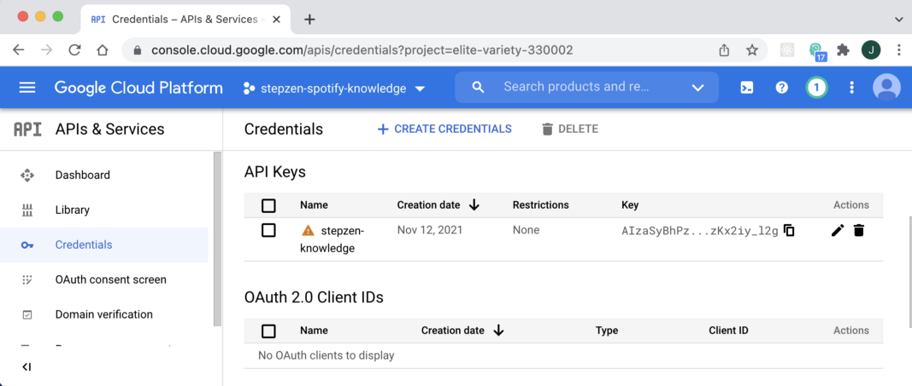
</p>

Unlike Google's API key–which never expires–Spotify's API requires an OAuth token, which only lasts for a duration of 3600 seconds (aka an hour.) Since the Spotify developer console includes a handy token generator at the bottom of each method, I just kept such a window open for fast token regeneration while experimenting. (Alternately, also easily [generated in Postman](https://medium.com/r/?url=https%3A%2F%2Fblog.postman.com%2Fspotify-music-discovery-with-postman%2F).)

<p align="center">
  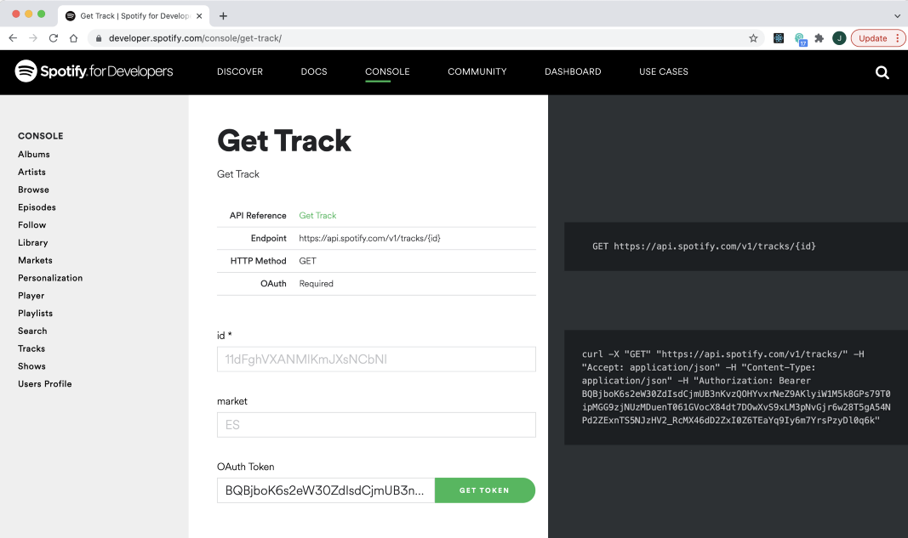
</p>

With your Google key and Spotify token plugged into the configuration options for each API, you'll be able to run live requests instantly in GraphQL Studio.

<p align="center">
  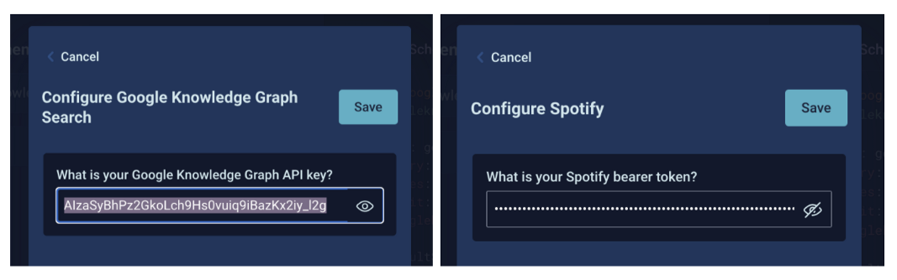
</p>

#### 3. Setting your API keys locally (and in the cloud) ####

Since we're interested in customizing StepZen's example queries, though, you'll want to click the Publish button on the top right of GraphQL Studio, and then choose Download and Build, which will yield a ready-to-use schema starter folder, requiring only the plugging in of keys and running of "stepzen start" from your terminal window to get going.

<p align="center">
  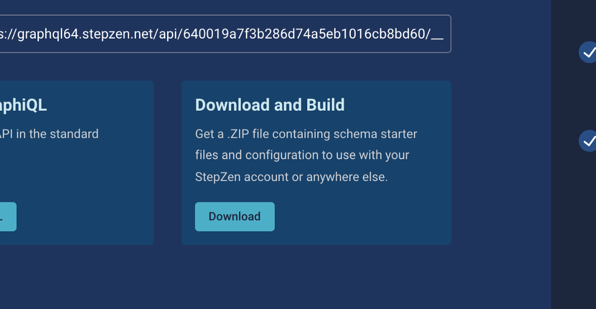
</p>

There's nothing terribly mysterious about StepZen's file structure, you'll notice: foldered graphql files for Spotify and Google, an index.graphql tying them together, a stepzen.config file with your project name, and a config.yaml, where you'll paste your key and token:

<p align="center">
  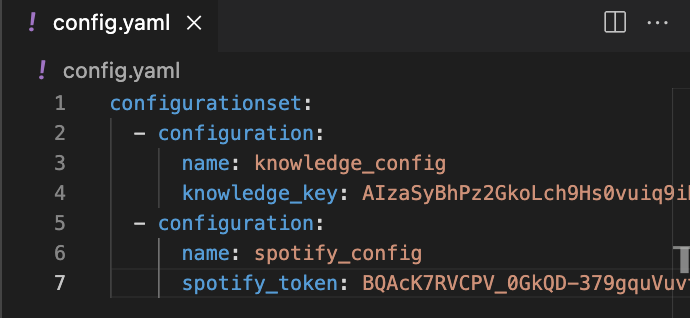
</p>

#### 3A. Testing in GraphiQL ####

After running stepzen start from your terminal, you'll also be given the url for a live endpoint running a GraphiQL explorer. You'll need to set your key and token in the Query Variables drawer at browser bottom, as below:

<p align="center">
  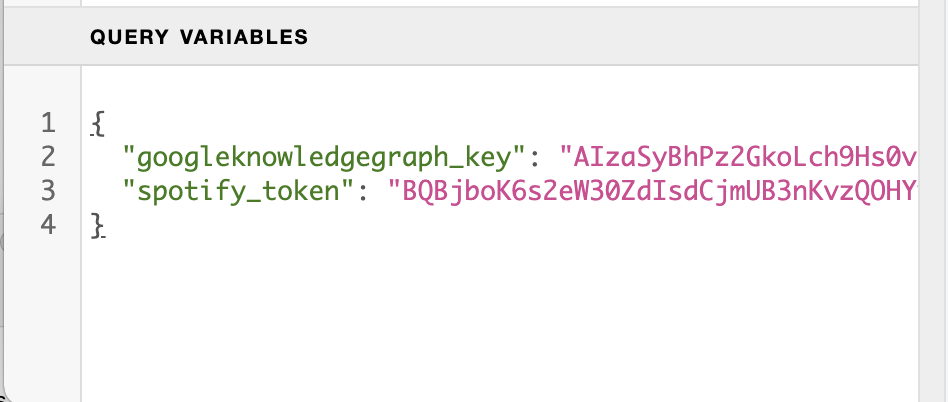
</p>

You'll also need to pass in those .env variables using GraphQL's arguments-passing syntax, like so:

<p align="center">
  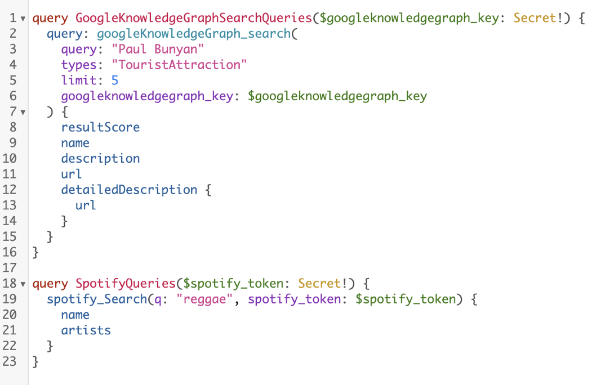
</p>

This syntax isn't required on your localhost GraphiQL, just on the cloud endpoint.

#### 4. Paring down StepZen's example GraphQL files ####

For the Spotify example schema, StepZen provides a nearly-complete set of pre-defined types and queries, only one of which we'll be using here: their Spotify_Search query and the Spotify_Track type it returns. For simplicity's sake, I've erased everything else:

<p align="center">
  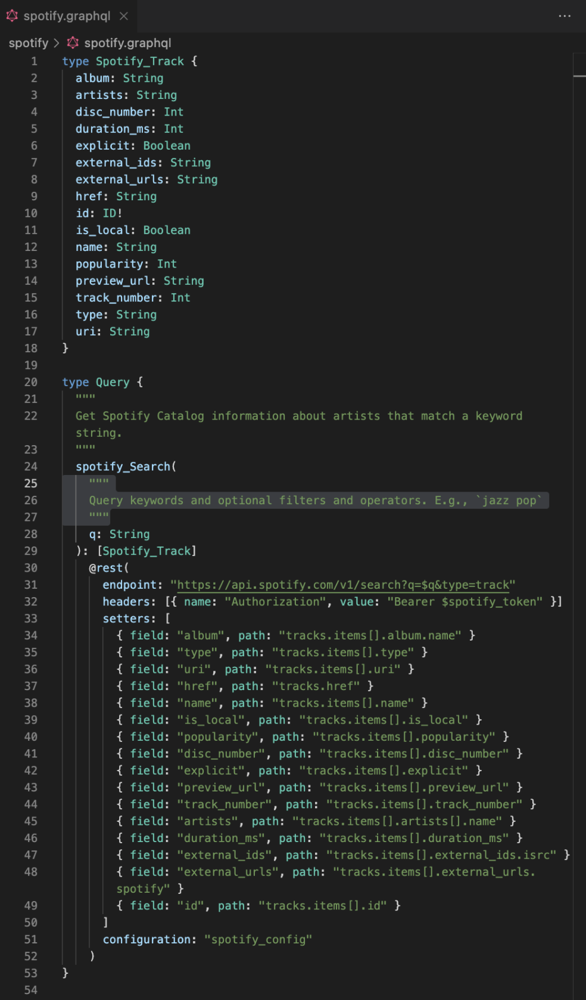
</p>

#### 5. Adding @materializer directives (with default values) ####

Finally, we add new information fields to our Spotify_Track schema–for album, artist, and track descriptions–which will fill themselves with data from the Knowledge Graph using StepZen's @materializer directive. 

[StepZen's docs explain](https://medium.com/r/?url=https%3A%2F%2Fstepzen.com%2Fdocs%2Ffeatures%2Flinking-types) the essentials, but as you'll see below there's not much to remember: we just have to specify a query (googleKnowledgeGraph_search) to fetch the info–making certain the field type matches the query's return type (GoogleKnowledgeGraph_Item)–and identify which fields we'd like to pass in as query arguments.

```graphql
type Spotify_Track {
  album: String
  albumInfo(
    types: String = "MusicAlbum"
  ): [GoogleKnowledgeGraph_Item]
      @materializer(
        query: "googleKnowledgeGraph_search"
        arguments: [
          { name: "query" field: "album" }
        ]
      )
  artists: String
  artistsInfo(
    types: String = "MusicGroup"
    ): [GoogleKnowledgeGraph_Item]
      @materializer(
        query: "googleKnowledgeGraph_search"
        arguments: [
          { name: "query" field: "artists" }
        ]
      )
  name: String
  trackInfo(
    types: String = "MusicRelease"
    ): [GoogleKnowledgeGraph_Item]
      @materializer(
        query: "googleKnowledgeGraph_search"
        arguments: [
          { name: "query" field: "name" }
        ]
      )
  duration_ms: Int
  href: String
  id: ID!
  popularity: Int
  preview_url: String
  track_number: Int
  type: String
  uri: String
}
```

You'll notice one important modification we make to all our queries: we set a specific default entity type as an argument for each query, which ensures that the Knowledge Graph returns results in the correct schema category. (As [Google's docs explain](https://medium.com/r/?url=https%3A%2F%2Fdevelopers.google.com%2Fknowledge-graph), the API uses standard schema.org types.)

<p align="center">
  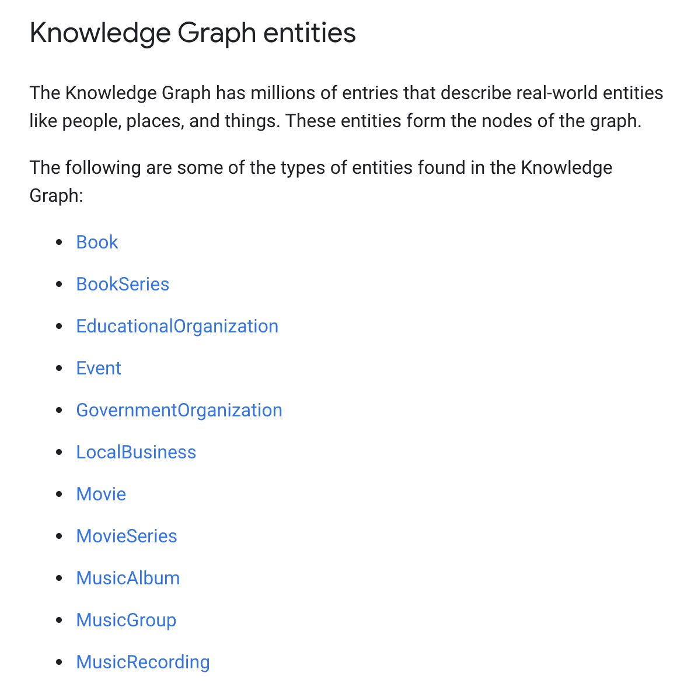
</p>

And with that, our Spotify track query now returns Knowledge-annotated data, with short (and shorter) descriptive summaries of a track, the album it came from, and its recording artist:

<p align="center">
  
</p>

For the full code, visit my GitHub repo at [januff/stepzen-spotify-knowledge](http://www.github.com/januff/stepzen-spotify-knowledge).