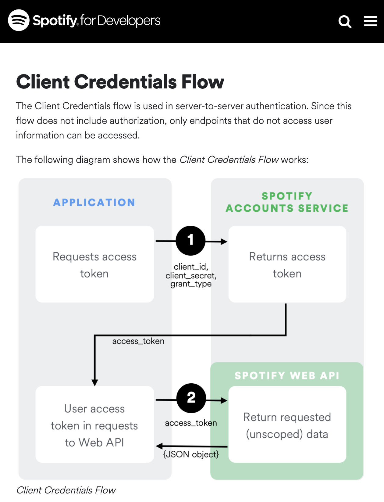
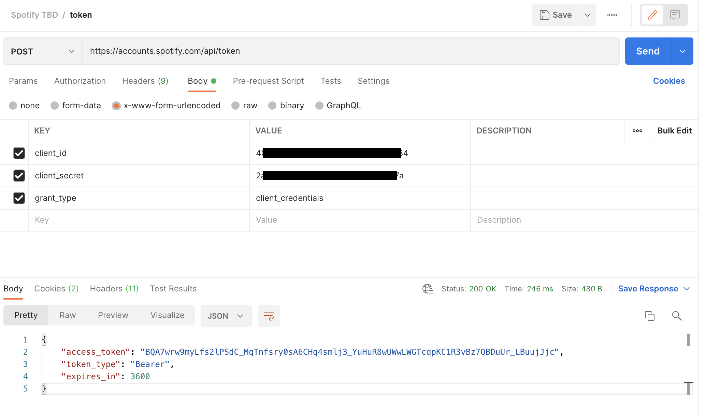
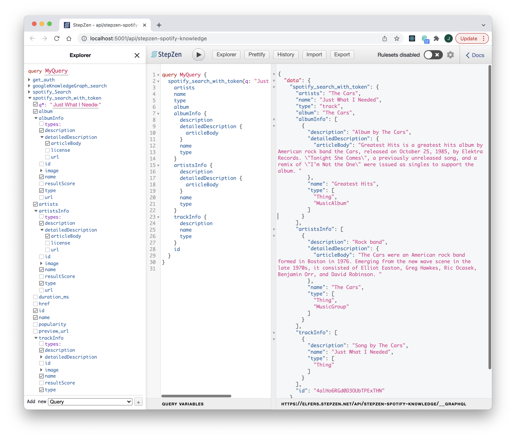

### Spotify OAuth 2.0 Tokens (in 3 Steps Total) ###
##### _Easily bundle an Access Token request with StepZen's <code>@sequence</code> directive_ #####

_(Editor's Note: In his last post, freelance developer Joey Anuff showed how easy it is to [combine Spotify and Google data using StepZen's <code>@materializer</code> directive](https://stepzen.com/blog/new-workflowf-for-api-mash-ups-postman-stepzen-youtube-data-api). We welcome him back to explain how StepZen's <code>@sequence</code> directive simplifies adding OAuth authorization to that request. For the full code, visit Joey's GitHub repo at [januff/stepzen-spotify-knowledge](https://github.com/januff/stepzen-spotify-knowledge).)_

When I used StepZen to sync the Spotify and Knowledge Graph APIs, I quickly encountered a common headache with mixed APIs: mixed authorization requirements. Specifically, requests to Google's Knowledge Graph require an API key that never expires, while requests to Spotify require an access token that expires after just an hour.

Hand-cranking a temporary token using the Spotify web dashboard was good enough for a quick demo, but given the simplicity of our OAuth request–which involves no user authentication, only application authentication–we were left with a perfect case study to illustrate StepZen's handling of the most basic of OAuth flows: the [Client Credentials Flow](https://developer.spotify.com/documentation/general/guides/authorization/client-credentials/).

<p align="center">
  
</p>

StepZen's <code>@sequence</code> directive, our tool for this task, is complementary to their <code>@materializer</code> directive–the former for extending query definitions, the latter for extending type definitions–and can be seen as different means to the same end: ordering your API calls.

Where <code>@materializer</code> allows us to step through our API requests in implicit order, simply by descending through our type fields and back-filling secondary data, <code>@sequence</code> lets us step through API requests in explicit order. Also different: unlike the <code>@materializer</code> directive, which we nest inside our type definitions, we locate the <code>@sequence</code> directive inside a query definition, a better home for transitory permissions data incidental to our <code>Spotify_Track</code> type.

Here's how, using <code>@sequence</code>, we loop in a call to Spotify's Auth endpoint in just three steps, a simplified version of Sam Hill's [recent Auth 2.0 walkthrough](https://stepzen.com/blog/sequence-oauth).


**1. Add Spotify Auth type and query to our Spotify GraphQL**

Spotify's authorization endpoint behaves the same as the HubSpot server in Sam's example, but our <code>grant_type</code> of <code>client_credentials</code> returns an even simpler JSON response, of which <code>access_token</code> is the only field we'll be preserving. 

<p align="center">
  
</p>

###### As always, we test our API endpoints in Postman first. ######

Translating this exchange into StepZen-enhanced GraphQL is as simple as defining a <code>Spotify_Auth</code> type and an <code>@rest</code>-powered query to return it, like so:


```
type Spotify_Auth {
  access_token: String!
}

type Query {
  get_auth: Spotify_Auth
    @rest(
      method: POST
      contenttype: "application/x-www-form-urlencoded"
      endpoint: "https://accounts.spotify.com/api/token?grant_type=client_credentials&client_id=$client_id&client_secret=$client_secret"
      configuration: "spotify_config"
    )
}
```

<br/>

**2. Add an authorization step to a new <code>@sequence</code>-driven query**

In a <code>@sequence</code> of steps, all fields returned from a prior step are automatically supplied as parameters to the next query, but prior fields or initial arguments need to be included, as with the initial <code>q</code> parameter in the <code>spotify_Search</code> step below.

```
type Query {
  spotify_search_with_token(
    q: String!
  ): Spotify_Track
    @sequence(
      steps: [
        { query: "get_auth" }
        { query: "spotify_Search"
          arguments: [
            { name: "q", argument: "q" }
          ]
        }        
      ]
    )
}
```

<br/>

**3. Add <code>access_token</code> as required argument to our old <code>spotify_Search</code> query**

Finally, we add access_token as a required argument to the <code>spotify_Search</code> query–instead of passing in the hand-coded value from our config, as I did in my first pass. It's still available as <code>$access_token</code>, but now it's a dynamic value, supplied by the prepended <code>get_auth</code> query from Step One.

```
type Query {
  """
  Get Spotify Catalog information about artists that match a keyword string.
  """
  spotify_Search(
    """
    Query keywords and optional filters and operators. E.g., `jazz pop`
    """
    q: String
    limit: Int = 1
    access_token: String!
  ): [Spotify_Track]
    @rest(
      endpoint: "https://api.spotify.com/v1/search?q=$q&type=track"
      headers: [{ name: "Authorization", value: "Bearer $access_token" }]

    (...)
```

<br/>

And that's it! Now we can explore our data at leisure, with no more fear of dying tokens.

<p align="center">
  
</p>

As we evolve our query to modify user data–expanding our <code>grant_type</code> and adding redirect URLs to our OAuth flow–we'll be adding new queries and steps, but we'll largely be relying on these same <code>@materializer</code> and <code>@sequence</code> directives to make them work.

