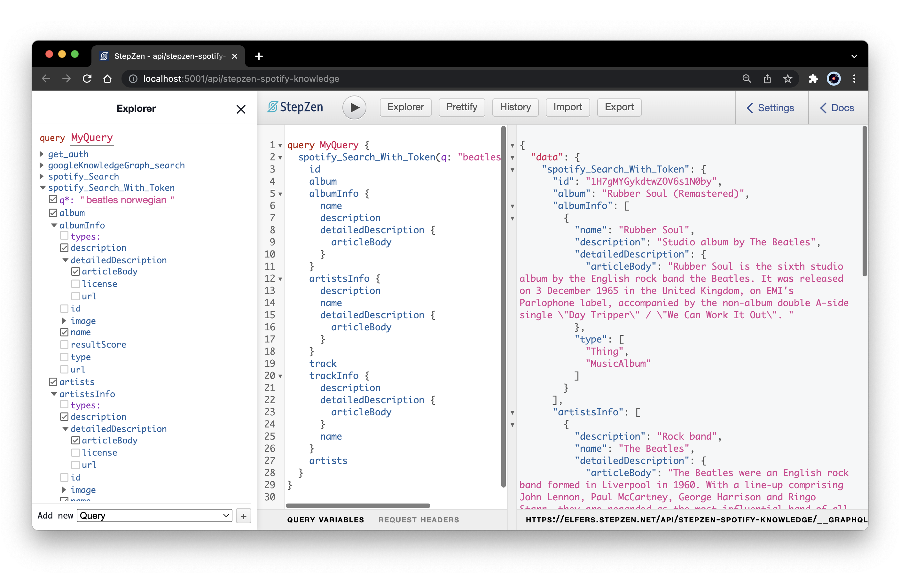
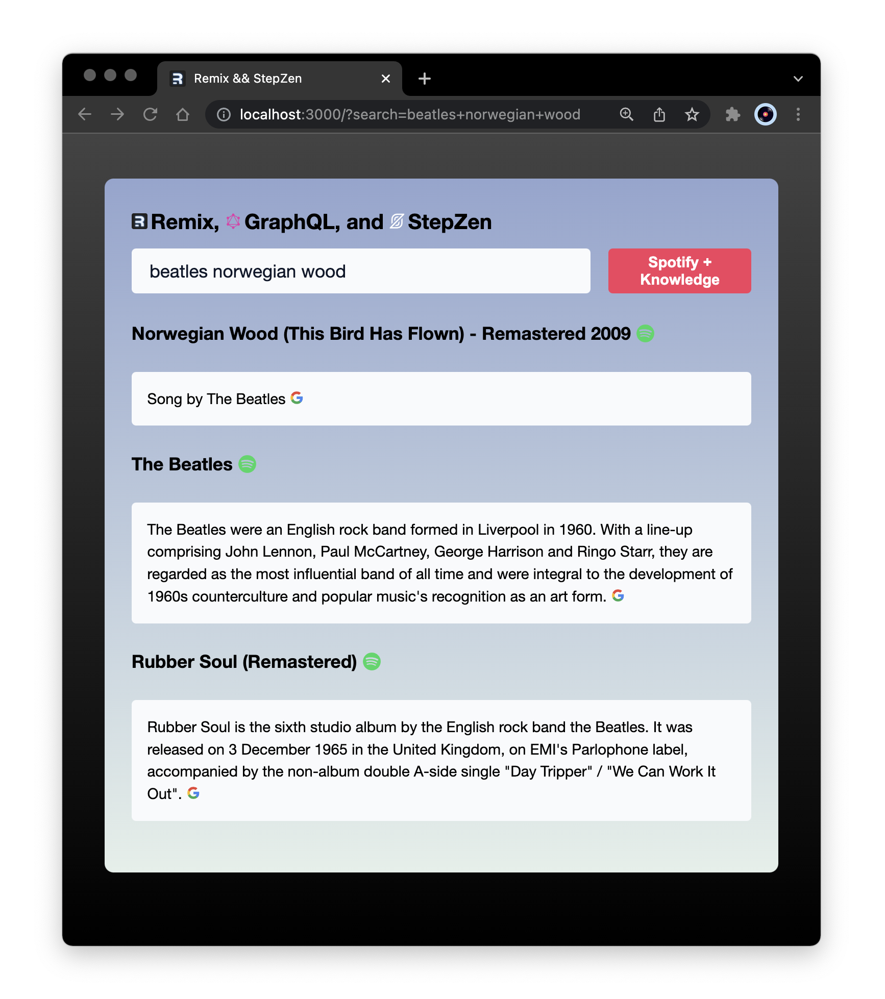

## Working With Remix, GraphQL, and StepZen ##


Two Next.js choices that always make me a little nervous: choosing a pre-rendering strategy (server or static or incremental?) and choosing a data hooks library (Apollo or react-query or urql?) So when a new web framework like Remix emerges, suggesting I might [be better off choosing neither](https://remix.run/blog/remix-vs-next), any excuse to install it will do.

Happily, some of DevRel’s craftiest React specialists must have been feeling the same way, leaving me with everything I need to answer the question: what’s the simplest pairing of a Remix app and a StepZen endpoint?

<p align="center">
  
</p>

Which is not to say Remix’s own docs aren’t [sufficiently instructive](https://remix.run/docs/en/v1/tutorials/blog)–besides their ecosystem credentials, the Remix team shares long stints in React training, which pays off in carefully illuminating site docs and YouTube nuggets. But as far as I could tell, they’d not yet put forth guidance on my specific question: _**how best to hook up a GraphQL endpoint to a Remix app, preferably no external dependencies**_. 

But with a few tricks culled from recent tutorials by GraphQL blogger [Jamie Barton](https://graphql.wtf/), JS live-streamer [Jason Lengstorf](https://twitter.com/jlengstorf), and advanced FE YouTuber [Jack Herrington](https://www.jackherrington.com/), I was surprised to learn how little time and code it takes to do precisely that.

**Trick 1: Plug in any GraphQL endpoint**

Jamie Barton I credit with the basic template I’m swiping here: [_**Working with Remix, GraphQL, and GraphCMS**_](https://graphcms.com/blog/working-with-remix-and-graphql), a simplest-possible GraphQL-driven Remix project with params-driven route loading. Like StepZen, GraphCMS provides developers with a single GraphQL endpoint, ensuring that instructions for hooking up one GraphQL service work as instructions for hooking up all GraphQL services.


```vim
npm install graphql-request graphql
```

Jamie's quickstart is perfectly replicable as is, but rather than import Prisma Lab's graphql-request client as he does, it seemed fitting–given Remix's hard preference for platform APIs–to try refactoring it to use the Web Fetch API (which Remix already polyfills on the server.)

**Trick 2: Use the basic Fetch API for GraphQL**

Towards the end of Jason Lengstorf’s highly recommended [framework walkthrough with Remix co-creator Ryan Florence](https://www.youtube.com/watch?v=pDdmF9ZhhAA), he reminds us of the simple pattern for querying GraphQL endpoints using the Fetch API, which he’d detailed earlier as a [no-nonsense how-to](https://www.netlify.com/blog/2020/12/21/send-graphql-queries-with-the-fetch-api-without-using-apollo-urql-or-other-graphql-clients/). (In short: specify a method, include headers, and <code>JSON.stringify()</code> the body.) 

Adapted to my <code>spotify_Search_With_Token</code> query, a GraphQL Fetch from my index page loader looks like this:


```js

export const loader = ({ request }) => {
  const url = new URL(request.url);
  const q = url.searchParams.get("search") ?? "Beatles Norwegian Wood";
  return getStepzen(q);
};

export async function getStepzen(query: string){
  let res = await fetch(`${process.env.STEPZEN_ENDPOINT}`, {
    method: "POST",
    headers: {
      "Content-Type": "application/json",
      "Authorization": `${process.env.STEPZEN_API_KEY}`
    },
    body: JSON.stringify({
      query: `
        query MyQuery($query: String!) {
          spotify_Search_With_Token(q: $query) {
            id
            artists
            artistsInfo {
              name
              description
              detailedDescription {
                articleBody
              }
            }
            track
            trackInfo {
              name
              description
              detailedDescription {
                articleBody
              }
            }
            album
            albumInfo {
              name
              description
              detailedDescription {
                articleBody
              }
            }
          }
        }`,
      variables: {
        query: query,
      },
    }),
  })
  return res.json();
}
```
Whether the syntax of graphql-request makes such a query any more readable, you'll have to judge for yourself. (I find them equally intelligible, I just prefer skipping the import.)

**Trick 3: Use Remix’s <code>useSearchParams</code> to track queries**

As far as building a simple search-input demo, I found [Jack Herrington’s Pokemon-themed speed-run on YouTube](https://www.youtube.com/watch?v=rgZkd-RAYfE) to provide a slightly easier template than [Kent C. Dodd’s search-input example](https://github.com/remix-run/remix/blob/main/examples/search-input/app/routes/index.tsx), particularly Jack’s post-tutorial insertion of Remix’s <code>useSearchParams</code> hook, which he references in a pinned YouTube comment. 

```js
export default function Stepzen() {

  const data  = useLoaderData();
  const { spotify_Search_With_Token: song } = useLoaderData().data;
  const [search, setSearch] = useState(useSearchParams()[0].get("search") ?? "");

  return (
    <div className="stepzen">
      <nav>
        <h3>Remix, GraphQL, and StepZen</h3>
      </nav>
      <Form method="get" className="search-form">
        <input
          defaultValue={search}
          placeholder="Band & Song..."
          autoComplete="off"
          name="search"
          type="search"
        />
        <button type="submit">Spotify + Knowledge</button>
    </Form>
      <main>
        { song.name ? (
          <div className="song-info">
            <h4>{song.name}</h4>
            <h5>{song.trackInfo[0]?.detailedDescription?.articleBody || song.trackInfo[0]?.description || ""}</h5>
            <h4>{song.artists ? song.artists : ""}</h4>
            <h5>{song.artistsInfo[0]?.detailedDescription?.articleBody || song.artistsInfo[0]?.description || ""}</h5>
            <h4>{song.album ? song.album: ""}</h4>
            <h5>{song.albumInfo[0]?.detailedDescription?.articleBody || song.albumInfo[0]?.description || ""}</h5>
          </div>
        )  : <h4>No Results</h4> }
      </main>
    </div>
  );
```

Using this approach, defining separate params-based routes isn't even necessary: the search params query in the URL already specifies the route.

Herrington’s video helpfully walks you through a quick Tailwind installation (also [well-explained on the Tailwind site](https://tailwindcss.com/docs/guides/remix)) but I've kept my CSS simple here, at least while I'm still learning the Remix basics.

<p align="center">
  
</p>


